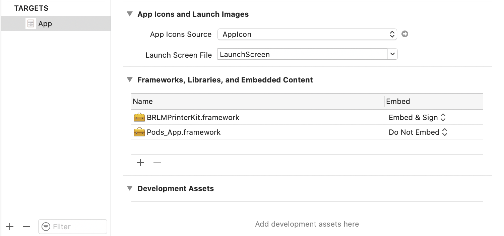
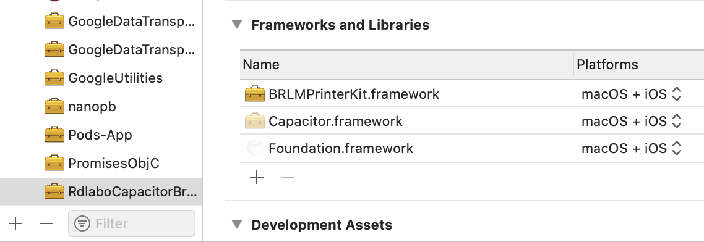

# @rdlabo/capacitor-brotherprint
Capacitor Brother Print is a native Brother Print SDK implementation for iOS & Android. This plugin can use in `QL-820NW` and `QL-800`.

## How to install
```
% npm install @rdlabo/capacitor-brotherprint@git@github.com:rdlabo-team/capacitor-brotherprint.git
```

## How to use

```typescript
import { Plugins } from '@capacitor/core';
const { BrotherPrint } = Plugins;
import { BrotherPrintOptions } from '@rdlabo/capacitor-brotherprint';

@Component({
  selector: 'brother-print',
  templateUrl: 'brother.component.html',
  styleUrls: ['brother.component.scss']
})
export class BrotherComponent {
  constructor() {
    // Success to print
    BrotherPrint.addListener('onPrint', (info) => {
      console.log("onPrint");
    });
    // Failed to communication with printer
    BrotherPrint.addListener('onPrintError', (info) => {
      console.log("onPrintError");
    });
    // Failed to communication with printer
    BrotherPrint.addListener('onPrintFailedCommunication', (info) => {
      console.log("onPrintFailedCommunication");
    });
  }
  print() {
    BrotherPrint.printImage({
      printerType: 'QL-820NW',
      encodedImage: 'base64 removed mime-type', // base64
    } as BrotherPrintOptions)
  }
  printWithNetWork() {
    const wifi = () => new Promise(resolve => {
      BrotherPrint.addListener('onIpAddressAvailable', (info) => {
        resolve(info);
      });
    });

    const ble = () => new Promise(resolve => {
      BrotherPrint.addListener('onBLEAvailable', (info) => {
        resolve(info);
      });
    });
    
    Promise.all([wifi(), ble()]).then((values) => {
      console.log(values);
    });

    BrotherPrint.searchWiFiPrinter();
    BrotherPrint.searchBLEPrinter();
  } 
}
```

## Installation
```
$ npm install --save @rdlabo/capacitor-brotherprint
```

### Android configuration
In file `android/app/src/main/java/**/**/MainActivity.java`, add the plugin to the initialization list:

```java
import jp.rdlabo.capacitor.plugin.brotherprint.BrotherPrint;

this.init(savedInstanceState, new ArrayList<Class<? extends Plugin>>() {{
    [...]
  add(BrotherPrint.class);
    [...]
}});
```

and download `BrotherPrintLibrary.aar` and put to your android project:
https://support.brother.co.jp/j/s/support/html/mobilesdk/guide/getting-started/getting-started-android.html

### iOS configuration
Download `BRLMPrinterKit.framework` and put to `Frameworks, Libraries, and Embedded Content`.


- App TARGETS APP



- Pods TARGETS RdlaboCapacitorBrotherPrint


You have to add Framework to RdlaboCapacitorBrotherPrint every time `npx cap update`.
